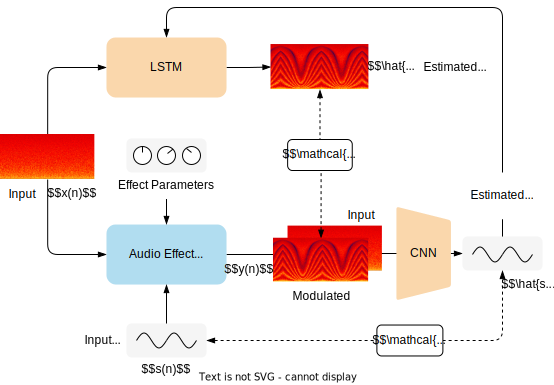

<h1>Modulation Extraction for LFO-driven Audio Effects</h1>

    <a href="https://christhetr.ee/" target=”_blank”>Christopher Mitcheltree</a>,
    <a href="https://www.christiansteinmetz.com/" target=”_blank”>Christian J. Steinmetz</a>,
    <a href="https://mcomunita.github.io/" target=”_blank”>Marco Comunità</a>, and
    <a href="https://www.eecs.qmul.ac.uk/~josh/" target=”_blank”>Joshua D. Reiss</a>

<h2>Links</h2>

<h3>
<a href="docs/docs/mitcheltree2023modulation.pdf" target=”_blank”>Paper</a>
&nbsp;&nbsp;&nbsp;&nbsp;
<a href="https://christhetree.github.io/mod_extraction/" target=”_blank”>Listening Samples</a>
&nbsp;&nbsp;&nbsp;&nbsp;
<a href="https://christhetree.github.io/mod_extraction/index.html#plugins" target=”_blank”>Plugins</a>
&nbsp;&nbsp;&nbsp;&nbsp;
<a href="https://youtu.be/" target=”_blank”>Video</a>
</h3>

<h2>Instructions for Reproducibility</h2>

<ol>
    <li>Clone this repository and open its directory.</li>
    <li>
    Install the requirements using  <code>conda env create --file=conda_env_cpu.yml</code> or  
    <code>conda env create --file=conda_env.yml</code>  for GPU acceleration.  
    <code>requirements_pipchill.txt</code> and <code>requirements_all.txt</code> are also provided as references, 
    but are not needed when using the <code>conda_env.yml</code> files.
    </li>
    <li>The source code can be explored in the <code>mod_extraction/</code> directory.</li>
    <li>All models from the paper can be found in the <code>models/</code> directory.</li>
    <li>Create an out directory (<code>mkdir out</code>).</li>
    <li>Create a data directory (<code>mkdir data</code>).</li>
    <li>
    Download the <a href="https://zenodo.org/record/7544110" target=”_blank”>IDMT-SMT-Guitar</a> and 
    <a href="https://zenodo.org/record/7044411#.YzRx2XbMKUl" target=”_blank”>EGFx</a> datasets and place their root 
    directories in the data directory.
    </li>
    <li>
    Rename the root directories of the datasets to <code>idmt_4</code>, <code>egfx_clean</code>, 
    <code>egfx_phaser</code>, <code>egfx_flanger</code>, and <code>egfx_chorus</code>.
    </li>
    <li>
    Use the methods in <code>scripts/split_datasets.py</code> to split each dataset into train, validation, and test 
    sets.
    </li>
    <li>
    (Optional) Download and install the free 
    <a href="https://www.meldaproduction.com/MPhaser" target=”_blank”>Melda Phaser</a> and 
    <a href="https://www.meldaproduction.com/MFlanger" target=”_blank”>Melda Flanger</a> plugins.
    </li>
    <li>
    (Optional) Open and modify the <code>ableton/melda_data_generation.als</code> project file in Ableton to export the 
    train, val, and test datasets for the unseen digital effects evaluation task. Input the 
    <code>data/idmt_4/</code> directory from step 8 when Ableton asks for the location of the missing audio files.
    </li>
    <li>
    All models can be trained by modifying <code>scripts/train.py</code> and the corresponding 
    <code>configs/train_ ... .yml</code> config file and then running <code>python scripts/train.py</code>.  
    Make sure your PYTHONPATH has been set correctly by running a command like 
    <code>export PYTHONPATH=$PYTHONPATH:BASE_DIR/mod_extraction/</code>.
    </li>
    <li>
    All models can be evaluated by modifying <code>scripts/validate.py</code> and the corresponding 
    <code>configs/eval_ ... .yml</code> config file and then running <code>python scripts/validate.py</code>.
    </li>
    <li>
    <a href="https://neutone.space" target=”_blank”>Neutone</a> files for running the effect models as a VST can be  
    exported by modifying and running the <code>scripts/export_neutone_models.py</code> file.
    </li>
    <li>
    The source code is currently not documented. Feel free to open an issue if you have any questions or comments.
    </li>
</ol>

<h2>Citation</h2>

Accepted to the 26th International Conference on Digital Audio Effects (DAFx23), Copenhagen, Denmark, 4 - 7 September 2023.

<pre><code>@inproceedings{mitcheltree2023modulation,
               title={Modulation Extraction for LFO-driven Audio Effects},
               author={Christopher Mitcheltree and Christian J. Steinmetz and Marco Comunità and Joshua D. Reiss},
               booktitle={International Conference on Digital Audio Effects (DAFx)},
               year={2023}}
</code></pre>

<h2>Abstract</h2>

Low frequency oscillator (LFO) driven audio effects such as phaser, flanger, and chorus, modify an input signal using time-varying filters and delays, resulting in characteristic sweeping or widening effects.
It has been shown that these effects can be modeled using neural networks when conditioned with the ground truth LFO signal.
However, in most cases, the LFO signal is not accessible and measurement from the audio signal is nontrivial, hindering the modeling process.
To address this, we propose a framework capable of extracting arbitrary LFO signals from processed audio across multiple digital audio effects, parameter settings, and instrument configurations.
Since our system imposes no restrictions on the LFO signal shape, we demonstrate its ability to extract quasiperiodic, combined, and distorted modulation signals that are relevant to effect modeling.
Furthermore, we show how coupling the extraction model with a simple processing network enables training of end-to-end black-box models of unseen analog or digital LFO-driven audio effects using only dry and wet audio pairs, overcoming the need to access the audio effect or internal LFO signal.
We make our code available and provide the trained audio effect models in a real-time VST plugin.

Send feedback and questions to <a href="https://christhetr.ee" target=”_blank”>Christopher Mitcheltree</a>.
 Scroll to <a href="#">top</a>.

